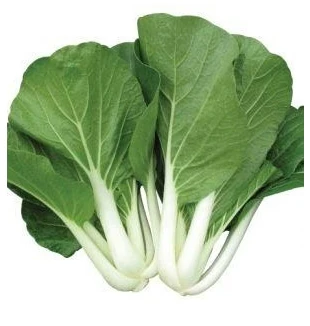
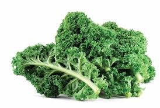

# Plant-Species-Image-Classification

A. Project Overview

**Brief description of the project:**

This project focuses on developing an image classification model that can identify different varieties of lettuce using Teachable Machine. The system is trained using images of various lettuce types, allowing it to recognize and classify them automatically based on their visual features. The goal of the project is to apply basic machine learning concepts to accurately distinguish between lettuce varieties through image recognition. The model is trained by uploading labeled images into Teachable Machine, which then generates a trained classification model.

**Purpose of the image classification model:**

The purpose of this project is to develop an image classification model that can accurately identify different lettuce varieties using machine learning. By training the model with labeled images, the system can automatically recognize and classify lettuce based on visual characteristics such as leaf shape, texture, and color.

## Embedded Screenshots Folders

- [📑 Exported Files](images/plants/images/Exported Files/)
- [📑 Model Evaluation](images/plants/images/Model Evaluation/)
- [📑 Model Training](images/plants/images/Model Training/)
- [📑 Model Training Details](images/plants/images/Model Training Details/)

B. Plant Species Section

<table>
<tr>
<td align="center" width="33%">
  
<b>Common Name: </b>Bibb Lettuce 
<b>Scientific Name: </b> <i>Lactuca sativa var. capitata ‘Bibb’
</i>   
<b>Description:</b> A small, soft-leafed lettuce with a buttery texture and mild flavor. It is rich in vitamins and easy to grow in home gardens or farms.
</td>

<td align="center" width="33%">
  
<b>Common Name: </b>Collards 
<b>Scientific Name: </b> <i>Collard Greens</i>   
<b>Description:</b> Collard greens are a type of hardy, dark green, leafy vegetable in the Brassica family, closely related to kale and cabbage. 
</td>

<td align="center" width="33%">
  
<b>Common Name: </b>Pechay / Bok Choy / Chinese Cabbage 
<b>Scientific Name: </b> <i>Brassica rapa subsp. chinensis</i>   
<b>Description:</b> Petchay (Bok Choy) is a leafy green vegetable with dark green leaves and thick white stalks.

</td>
</table>

<table>
<tr>
<td align="center" width="33%">
  
<b>Common Name: </b>Lettuce 
<b>Scientific Name: </b> <i> Lactuca Sativa</i>   
<b>Description:</b> A leafy green vegetable commonly used in salads and sandwiches, with crisp leaves and mild flavor. Grown as an agricultural crop worldwide.

</td>

<td align="center" width="33%">
  
<b>Common Name: </b>Butterhead Lettuce 
<b>Scientific Name: </b> <i>Lactuca sativa var. capitata</i>   
<b>Description:</b> A soft, tender leafy vegetable with loosely packed, buttery-textured leaves. It is rich in vitamins A and K and grown as an agricultural crop.
</td>

<td align="center" width="33%">
  
<b>Common Name: </b>Little Gem Lettuce 
<b>Scientific Name: </b> <i>Lactuca sativa var. capitata ‘Little Gem’</i>   
<b>Description:</b> A small, crisp lettuce with tender, sweet leaves. Often used in salads and as a garnish, it is nutritious and easy to grow in gardens or agricultural settings.

</td>
</table>

<table>
<tr>
<td align="center" width="33%">
  
<b>Common Name: </b>Fennel 
<b>Scientific Name: </b> <i> Foeniculum vulgare</i>   
<b>Description:</b> A crunchy, aromatic vegetable with a bulbous base, feathery green leaves, and a mild anise-like flavor. Commonly used in salads, soups, and cooking, it is rich in fiber, vitamin C, and antioxidants.

</td>

<td align="center" width="33%">
  
<b>Common Name: </b>Kohlrabi / German Turnip 
<b>Scientific Name: </b> <i>Brassica oleracea var. gongylodes</i>   
<b>Description:</b> A crunchy, bulbous vegetable with edible stems and leaves. It has a mild, slightly sweet flavor and is commonly eaten raw in salads or cooked in soups and stir-fries.
  
</td>

<td align="center" width="33%">
  
<b>Common Name: </b>Celery 
<b>Scientific Name: </b> <i>Apium graveolens</i>   
<b>Description:</b> A crunchy, fibrous vegetable with long green stalks and feathery leaves. Commonly used in salads, soups, and stir-fries, it is low in calories and rich in vitamins A, C, and K, as well as dietary fiber.

</td>
</table>

<table>
<tr>
<td align="center" width="33%">
  
<b>Common Name: </b>Kale 
<b>Scientific Name: </b> <i>Brassica oleracea var. sabellica</i>   
<b>Description:</b> A leafy green vegetable with curly or flat leaves and a slightly bitter flavor. Commonly used in salads, smoothies, and cooking, it is rich in vitamins A, C, and K, as well as antioxidants and fiber.

</td>

<td align="center" width="33%">
  
<b>Common Name: </b>Romaine Lettuce / Cos Lettuce 
<b>Scientific Name: </b> <i>Lactuca sativa var. longifolia</i>   
<b>Description:</b> A crisp, elongated leafy vegetable with a firm rib down the center. Commonly used in salads like Caesar salad, it is rich in vitamins A, C, and K, and is widely cultivated as an agricultural crop.
  
</td>

<td align="center" width="33%">
  
<b>Common Name: </b>Iceberg Lettuce 
<b>Scientific Name: </b> <i>Lactuca sativa var. capitata</i>   
<b>Description:</b> A crisp, pale green lettuce with tightly packed, round heads. Commonly used in salads and sandwiches, it has a mild flavor and is rich in water and dietary fiber.

</td>
</table>

<table>
<tr>
<td align="center" width="33%">
  
<b>Common Name: </b>Arugula / Rocket 
<b>Scientific Name: </b> <i>Eruca vesicaria</i>   
<b>Description:</b> A leafy green with a peppery, slightly bitter taste. Commonly used in salads, sandwiches, and garnishes, it is rich in vitamins A, C, and K, as well as antioxidants.

</td>

<td align="center" width="33%">
  
<b>Common Name: </b>Escarole 
<b>Scientific Name: </b> <i>Cichorium endivia var. latifolia</i>   
<b>Description:</b> A leafy green with broad, slightly curly leaves and a mildly bitter taste. Commonly used in salads, soups, and sautés, it is rich in vitamins A and K, fiber, and antioxidants.
  
</td>

<td align="center" width="33%">
  
<b>Common Name: </b>Buttercrunch Lettuce 
<b>Scientific Name: </b> <i> Lactuca sativa var. capitata ‘Buttercrunch’</i>   
<b>Description:</b> A crisp, tender lettuce with soft, buttery-textured leaves. Commonly used in salads and sandwiches, it is easy to grow and rich in vitamins A and K.

</td>
</table>

<table>
<tr>
<td align="center" width="33%">
  
<b>Common Name: </b>Batavia Lettuce 
<b>Scientific Name: </b> <i>Lactuca sativa var. capitata ‘Batavia’</i>   
<b>Description:</b> A crisp, semi-loose leafy lettuce with a mild, slightly sweet flavor. Commonly used in salads and sandwiches, it is crunchy, nutritious, and grown as an agricultural crop.

</td>

<td align="center" width="33%">
  
<b>Common Name: </b>Frisée / Curly Endive 
<b>Scientific Name: </b> <i>Cichorium endivia var. crispa</i>   
<b>Description:</b>  A leafy green with finely curled, bitter-tasting leaves. Commonly used in salads and garnishes, it adds texture and flavor and is rich in vitamins A and K, fiber, and antioxidants.
  
</td>

<td align="center" width="33%">
  
<b>Common Name: </b>Green Leaf Lettuce 
<b>Scientific Name: </b> <i>Lactuca sativa var. crispa</i>   
<b>Description:</b>  A leafy vegetable with loose, tender green leaves and a mild flavor. Commonly used in salads and sandwiches, it is rich in vitamins A, C, and K, and easy to cultivate as an agricultural crop.

</td>
</table>

<table>
<tr>
<td align="center" width="33%">
  
<b>Common Name: </b>Oak Leaf Lettuce 
<b>Scientific Name: </b> <i>Lactuca sativa var. crispa</i>   
<b>Description:</b> A leafy green with soft, lobed leaves resembling oak leaves. It has a mild flavor, is commonly used in salads and sandwiches, and is rich in vitamins A, C, and K.

</td>

<td align="center" width="33%">
  
<b>Common Name: </b>Loose Leaf Lettuce 
<b>Scientific Name: </b> <i>Lactuca sativa var. crispa</i>   
<b>Description:</b>  A leafy vegetable with loose, tender leaves that do not form a head. Commonly used in salads and sandwiches, it has a mild flavor and is rich in vitamins A, C, and K.

</td>
</table>

## Model Evaluation

<table>
<tr>
<td align="center" width="50%">
  
</td>
</table>

## Model Training

<table>
<tr>
<td align="center" width="50%">
  
</td>

  <td align="center" width="50%">
  
</td>

<table>
<td align="center" width="50%">
  
</td>

<td align="center" width="50%">
  
</td>
</table>

<table>
<td align="center" width="50%">
  
</td>

<td align="center" width="50%">
  
</td>
</table>

<table>
<td align="center" width="50%">
  
</td>

<td align="center" width="50%">
  
</td>
</table>

<table>
<td align="center" width="50%">
  
</td>

<td align="center" width="50%">
  
</td>
</table>

## Model Training Details

<table>
<td align="center" width="50%">
  
<b>Dataset 1</b> 
</td>

<td align="center" width="50%">
  
<b>Dataset 2</b> 
</td>
</table>

<table>
<td align="center" width="50%">
  
<b>Dataset 3</b> 
</td>

<td align="center" width="50%">
  
<b>Dataset 4</b> 
</td>
</table>

<table>
<td align="center" width="50%">
  
<b>Dataset 5</b> 
</td>

<td align="center" width="50%">
  
<b>Training Settings</b> 
</td>
</table>

## Reflection Questions

**1. How did the number of images per class affect your model’s accuracy?**

The quantity of images in each class significantly influenced the model’s accuracy. When certain classes contained fewer images, the model struggled to properly learn their distinct features due to insufficient training data, which led to more misclassifications. On the other hand, classes with a larger and balanced number of images allowed the model to better understand patterns and variations among the  plants. This balanced distribution enhanced the model’s learning process, resulting in improved accuracy and overall performance.

**2. Which plant species were most commonly misclassified and why?**

The results showed that none of the plant species were commonly confused with one another. The model effectively distinguished between all categories, indicating strong learning performance. This suggests that the dataset provided clear visual distinctions and adequate image distribution per class, leading to reliable and accurate predictions.

**3. How did changing the epochs, batch size, or learning rate affect the training results?**

Changing the number of epochs, batch size, and learning rate affected how well the model trained. When the epochs were increased, the model learned more and accuracy improved. However, too many epochs caused overfitting, where the model worked well on training data but not on new data. Smaller batch sizes helped the model learn better but made training slower. Larger batch sizes made training faster, but sometimes the accuracy became lower.

**4. What challenges did you encounter during dataset collection and labeling?**

Collecting a large number of images for every plant took effort and patience. Keeping the pictures clear and consistent was challenging. Sometimes, similar-looking plants made it easy to accidentally label images incorrectly.

**5. If you were to improve your model, what specific changes would you make and why?**

To improve the model, I would increase the number of images for each plant species to provide the model with more data to learn from. Ensuring that each class has an equal number of images would help prevent bias and improve classification accuracy. I would also collect images under varying lighting conditions, angles, and backgrounds to enhance the model’s ability to generalize to real-world scenarios. Applying data augmentation techniques, such as rotation, flipping, and zooming, could further increase dataset diversity. Finally, fine-tuning training parameters, including the number of epochs and batch size, could optimize the model’s learning process and overall performance.

